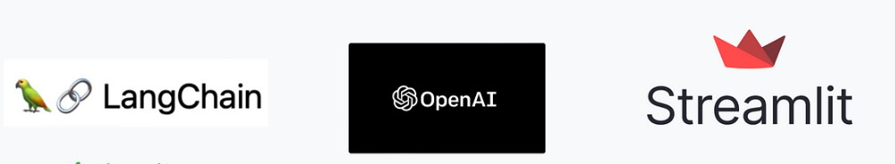

#  Gaurav Verma A
## Project Portfolio 🚀

This repository contains a collection of my projects.

## [Course Recommendation System using Udemy Dataset 📚](https://github.com/hi-gv/Udemy-course-Recommendation-System)

- Course recommendation system built on Udemy dataset from Kaggle, utilizing course titles and descriptions.
- **Used:** Python | Pandas Dataframes | Scikit-learn | Cosine Similarity Matrix.

<br>

## [Web Scraping of Indeed Jobs site 🔍](https://github.com/hi-gv/IndeedScrapper)

- Script to scrape data off of 'indeed.co.in' for data science roles and generate a report in CSV format.
- **Used:** Python | Selenium WebDriver

<br>

## [Explored different automated Exploratory data analytics libraries like d-tale, pandas-profiling 📊](https://github.com/hi-gv/Exploratory-Data-Analytics-Tools)

- This Jupyter notebook was starred on GitHub by the creator of the D-tale library.
- I have explored various automated Exploratory Data Analysis libraries.

<br>

## [BookmyShow ticket availability WhatsApp alerting for Movie opening 🎥](https://github.com/hi-gv/Whatsapp-Alert-when-tickets-available-on-BookMyShow)

- Real-life use case project to send WhatsApp alerts whenever the booking for the Spiderman movie opens on BookmyShow, as it doesn't provide APIs.
- **Used:** Python | pywhatkit | Selenium WebDriver

<br>

## [Exploratory Data Analysis on Zomato Dataset 🍴](https://github.com/hi-gv/Exploratory-Data-Analysis-Zomato)

- Handled dirty data, performed cleaning, and analyzed how certain fields affect others through visualizations.
- **Used:** Pandas | Seaborn | Pandas-Profiling

<br>

## [Streamlit app integration with OpenAI ChatGPT APIs 💬](https://github.com/hi-gv/ChatGPT-APIs--Streamlit--Lotte-Animation)

- Used Streamlit to allow users to invoke OpenAI ChatGPT APIs for 4 features: explain Python, make SQL queries, sentiment analysis, and grammar checking.
- Incorporated Lotte animations to increase UX and improve the professional look.

<br>

## [gvBOT - Upload your PDF and Ask Qs using LLMs 🤖](https://github.com/hi-gv/gvBot---QA-PDF)
- Used Langchain and OpenAIEmbeddings to allow users to upload PDFs and query a Bot-like interface using Streamlit.

<br>

Feel free to explore the individual project by clicking for more details and code implementations.
Let's connect on [LinkedIn](https://www.linkedin.com/in/hi-gv/) 👋


```
```
